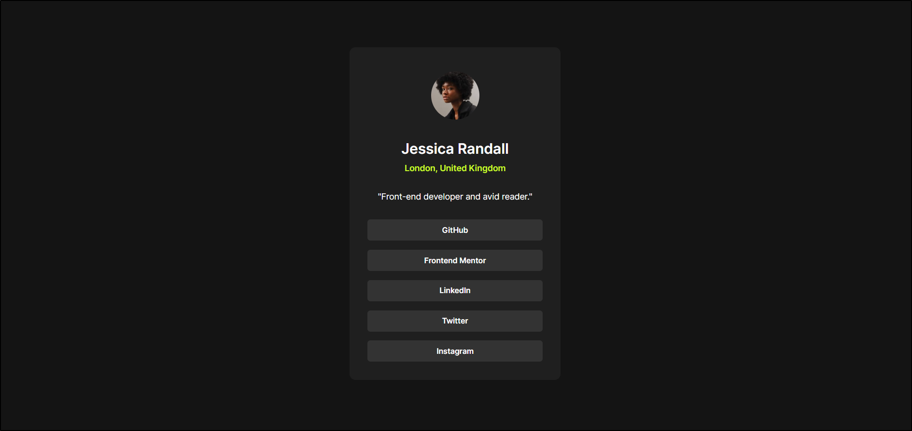
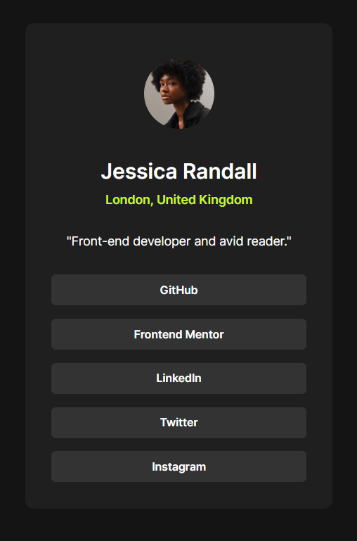

# Frontend Mentor - Social Links Profile

This is my solution to the Social Links Profile challenge from Frontend Mentor.

## Overview

### Desktop Preview

### Mobile Preview

## Links

- Live Site: https://your-netlify-link.netlify.app/
- Repository: https://github.com/KylarSec/frontend-mentor-social-links-profile

## Built With

- HTML5
- CSS3
- Flexbox
- Responsive Design
- CSS Variables
- Local Fonts with `@font-face`

## What I Learned

Through this project, I practiced:

- Building responsive profile card layouts
- Using Flexbox for vertical alignment
- Styling full-width interactive links
- Working with hover states and transitions
- Using local fonts with `@font-face`
- Improving spacing and typography hierarchy

## Author

- GitHub: KylarSec
